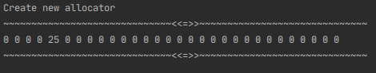
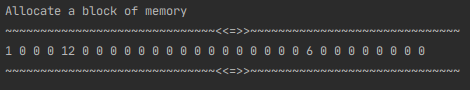
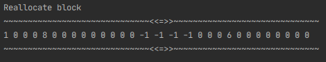
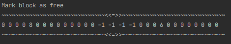

# General info

Java implementation of **general-purpose allocator**. 
Any general-purpose allocator has to have at least three functions:    
 - allocation of the memory block with the specified size
 - freeing the specified block of memory
 - re-allocating the specified block (changing its size)

These functions are called `mem_alloc()`, `mem_free()` and `mem_realloc()` correspondingly.
       
## Header and related function

The size of the header is 5 bytes.
- `createNewHeaderAfterNewBlock()` - generates a new header
- `getLengthOfBlock()` - retrieves the size of the block from the header
- `getSizeWithAlignment()` - calculates the size of the new block accounting the alignment (4 bytes)   
    
## Methods descriptions       

`mem_realloc(int address, int newSizeOfExistingBlock)`   
    Can be used both for decreasing and increasing the size of the existing block of memory. 
    The content of the old block is always copied to the new one. 
    If it was impossible to re-allocate the block, returns `null` and the block 
    is marked as unoccupied.
 
`mem_alloc(int size)`
    Allocates a block of specified size for further usage by the program.
 
`mem_free(int address)`
    Marks a specified block of memory as unoccupied and free for allocation or re-allocation.
    
 # Usage   
 
 ### Creating a new allocator    
 ```  
    System.out.println("Create new allocator");
    Allocator allocator = new MemoryAllocator(30);
    allocator.dump();
```
Result: 


   

### Allocate a new block
```
    System.out.println("Allocate a block of memory");
    allocator.mem_alloc(9);
    allocator.dump();
```
Result:  

   

### Re-allocate a block
```
    System.out.println("Reallocate block");
    allocator.mem_realloc(0, 7);
    allocator.dump();
```

Result:  

   

### Mark the block as free

```
    System.out.println("Mark the block as free");
    allocator.mem_free(0);
    allocator.dump();
```

Result:  

   

